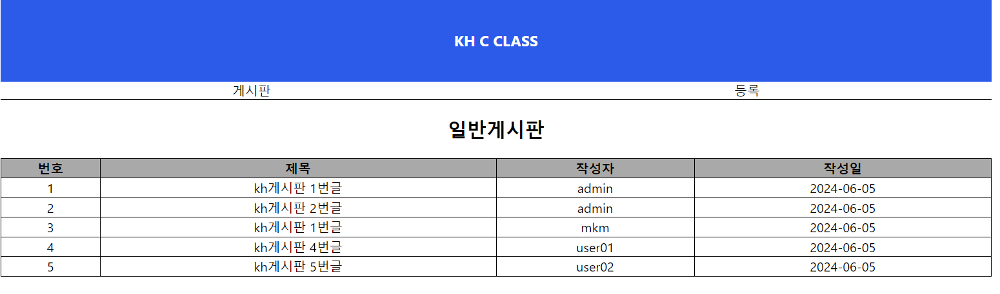
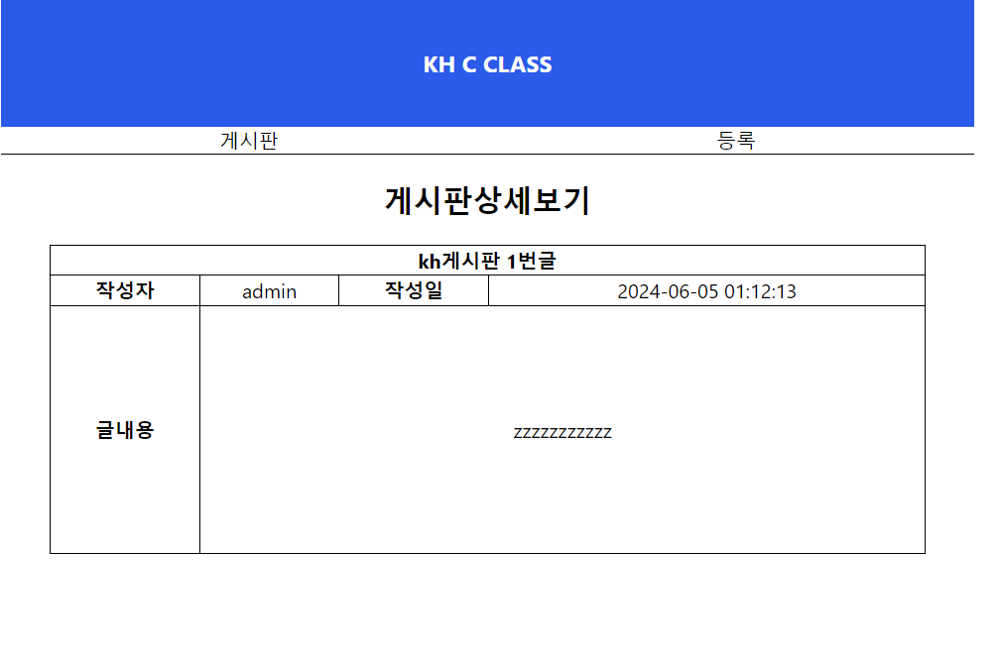
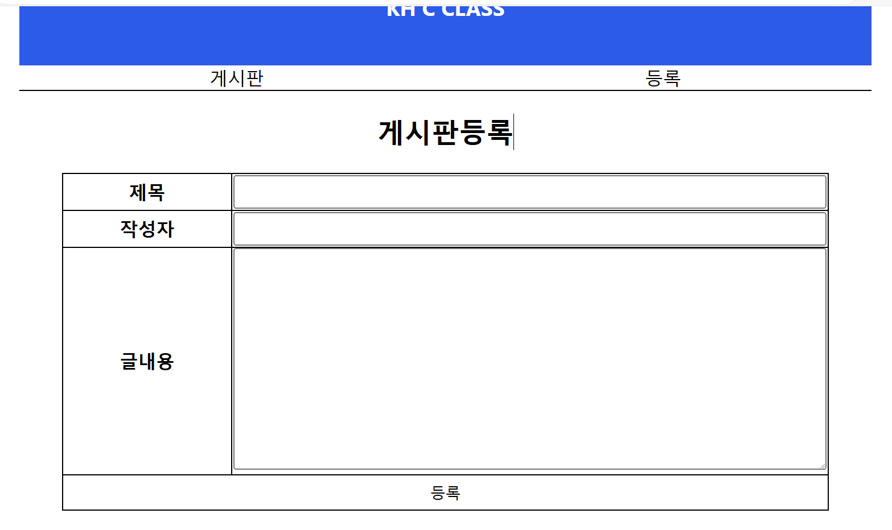
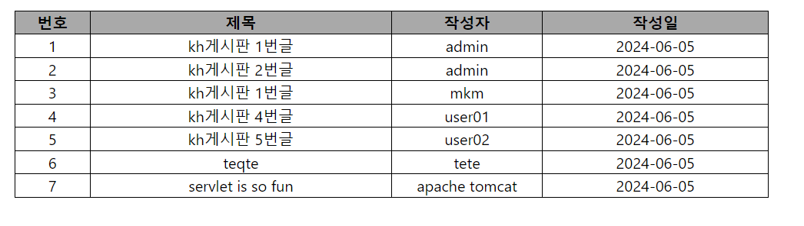

# 기능 요구사항
## 1. 초기화면 로드(비동기 x)
  - 구현 서블릿클래스명 : com.kh.board.BoardServlet
  - 매핑url : (GET) /ajax/board
  - 상세 설명 : index.html에서 /ajax/board로 요청시 /board/board.jsp 페이지를 반환하는 서블릿을 구현한다. board.jsp를 반환하기전, 게시글 목록 데이터(List<Board>)가 Session scope에 존재하지 않는 경우, 2. 게시판 목록보기이미지를 참고하여 적절한 초기 데이터를 추가한다.

## 2. 게시판 목록보기
 - 구현 서블릿클래스명 : com.kh.board.BoardListServlet
 - 매핑url : (GET) /ajax/board/list
 - 상세설명 : 네비게이션 바의 "게시판" 버튼을 클릭시 비동기 함수를 이용하여 목록페이지(/board/list.jsp)를 얻어와서 화면(.outer)에 출력

## 3. 상세보기
 - 구현 서블릿클래스명 : com.kh.board.BoardViewServlet
 - 매핑url : (GET) /ajax/board/view
 - 상세설명 : 게시글 목록의 각 행을 클릭하면 비동기 함수로 해당 게시글의 상세 내용(/board/view.jsp)을 얻어와서 화면(.outer)에 출력.
 - 힌트 : 내가 선택한 게시글의 글번호를 요청시 함께 전달하여 게시글배열에서 내가 선택한 게시글을 찾는다.

## 4. 등록페이지 이동
 - 구현 서블릿클래스명 : com.kh.board.BoardInsertServlet
 - 매핑url : (GET) /ajax/board/insert
 - 상세설명 : 등록 버튼 클릭시 ajax를 이용하여 등록페이지(/board/insert.jsp)를 얻어와서 화면(.outer)에 출력

## 5. 게시글 등록
 - 구현 서블릿클래스명 : com.kh.board.BoardInsertServlet
 - 매핑url : (POST) /ajax/board/insert
 - 상세기능 : 게시글 등록 페이지에서 작성된 게시글 정보를 서버로 전송한 후 게시글정보를 session scope에 저장 후 , 게시글 목록페이지를 화면상에 출력한다.
 - 게시글 정보는 List<Board>형태로 저장 및 관리한다.
 - 힌트 : 사용자가 입력한 값을 Board형태로 변환 후 List의 마지막에 추가한다.
         (Board는 com.kh.board.model.vo.Board를 참고)

